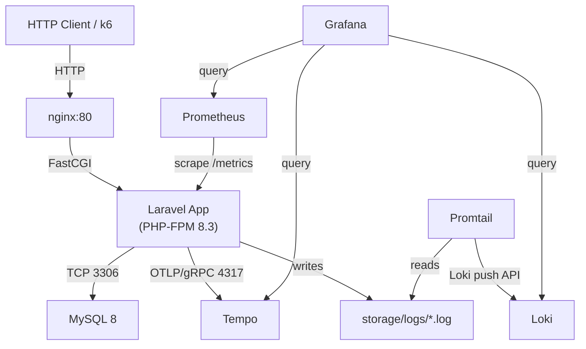

# Design Document — Laravel Observability Demo

## Overview

The Laravel Observability Demo is a self-contained backend application that demonstrates production-grade observability on a realistic REST API. The system is intentionally simple in business logic so that the observability layer — metrics, logs, and traces — is the primary focus.

The application exposes a JSON REST API (users, products, orders) backed by MySQL. Every request is instrumented with:

- **Prometheus metrics** — counters, gauges, and histograms scraped from `/metrics`
- **Structured JSON logs** — written to disk and forwarded to Loki by Promtail
- **OpenTelemetry traces** — exported via OTLP/gRPC to Tempo

All signals are visualised in Grafana. A k6 script drives synthetic load, and two deliberate anomalies (artificial delay middleware + inefficient query) validate that the stack surfaces degradation.

The entire stack runs with `docker compose up`.

---

## Architecture



### Request flow

```
Client → nginx (reverse proxy) → PHP-FPM (Laravel)
                                      │
                          ┌───────────┼───────────────┐
                          ▼           ▼               ▼
                       MySQL      OTel SDK         Monolog
                    (queries)   (spans → Tempo)  (JSON → disk)
                                                      │
                                                  Promtail
                                                      │
                                                    Loki
```

---

## Components and Interfaces

### Laravel Application

| Component                      | Responsibility                                     |
| ------------------------------ | -------------------------------------------------- |
| `AuthController`               | Register / login, issues Sanctum tokens            |
| `ProductController`            | CRUD for products, delegates to `ProductService`   |
| `OrderController`              | Order creation, delegates to `OrderService`        |
| `ProductService`               | Business logic, query building, anomaly hook       |
| `OrderService`                 | Transaction management, stock decrement            |
| `MetricsController`            | Renders `/metrics` in Prometheus text format       |
| `AnomalyDelayMiddleware`       | Injects configurable sleep before response         |
| `ObservabilityServiceProvider` | Boots OTel tracer, registers DB listeners          |
| `JsonLogFormatter`             | Formats Monolog records as JSON with trace context |

### Middleware stack (per request)

```
TraceMiddleware          ← starts root span, injects trace_id into log context
AnomalyDelayMiddleware   ← conditional sleep (ANOMALY_DELAY_ENABLED)
RequestLogMiddleware     ← logs method/uri/status/duration/user_id
MetricsMiddleware        ← records http_request_duration_seconds, active_requests
```

### External service interfaces

| Service    | Protocol    | Port | Purpose                        |
| ---------- | ----------- | ---- | ------------------------------ |
| MySQL      | TCP         | 3306 | Primary data store             |
| Tempo      | OTLP/gRPC   | 4317 | Trace ingestion                |
| Prometheus | HTTP scrape | 9090 | Pulls `/metrics` from app:9000 |
| Loki       | HTTP push   | 3100 | Receives logs from Promtail    |
| Grafana    | HTTP        | 3000 | Dashboard UI                   |

---

## Data Models

### Database Schema

```sql
-- users
CREATE TABLE users (
    id          BIGINT UNSIGNED AUTO_INCREMENT PRIMARY KEY,
    name        VARCHAR(255)        NOT NULL,
    email       VARCHAR(255) UNIQUE NOT NULL,
    password    VARCHAR(255)        NOT NULL,
    created_at  TIMESTAMP           NULL,
    updated_at  TIMESTAMP           NULL
);

-- products
CREATE TABLE products (
    id          BIGINT UNSIGNED AUTO_INCREMENT PRIMARY KEY,
    name        VARCHAR(255)        NOT NULL,
    description TEXT                NULL,
    price       DECIMAL(10,2)       NOT NULL,
    stock       INT UNSIGNED        NOT NULL DEFAULT 0,
    deleted_at  TIMESTAMP           NULL,   -- soft delete
    created_at  TIMESTAMP           NULL,
    updated_at  TIMESTAMP           NULL,
    INDEX idx_products_name (name),
    INDEX idx_products_price (price)
);

-- orders
CREATE TABLE orders (
    id          BIGINT UNSIGNED AUTO_INCREMENT PRIMARY KEY,
    user_id     BIGINT UNSIGNED     NOT NULL,
    status      ENUM('pending','completed','cancelled') NOT NULL DEFAULT 'pending',
    total_price DECIMAL(10,2)       NOT NULL,
    created_at  TIMESTAMP           NULL,
    updated_at  TIMESTAMP           NULL,
    FOREIGN KEY (user_id) REFERENCES users(id),
    INDEX idx_orders_user_id (user_id),
    INDEX idx_orders_status (status),
    INDEX idx_orders_created_at (created_at)
);

-- order_items
CREATE TABLE order_items (
    id          BIGINT UNSIGNED AUTO_INCREMENT PRIMARY KEY,
    order_id    BIGINT UNSIGNED     NOT NULL,
    product_id  BIGINT UNSIGNED     NOT NULL,
    quantity    INT UNSIGNED        NOT NULL,
    unit_price  DECIMAL(10,2)       NOT NULL,
    created_at  TIMESTAMP           NULL,
    updated_at  TIMESTAMP           NULL,
    FOREIGN KEY (order_id)  REFERENCES orders(id),
    FOREIGN KEY (product_id) REFERENCES products(id)
);
```

### Eloquent Models

- `User` — HasMany `orders`; uses Laravel Sanctum for token auth
- `Product` — SoftDeletes; HasMany `orderItems`
- `Order` — BelongsTo `user`; HasMany `orderItems`; computed `total_price` attribute
- `OrderItem` — BelongsTo `order`, `product`

---

## API Endpoints

All endpoints are prefixed `/api/v1`. Authenticated endpoints require `Authorization: Bearer <token>`.

### Auth

| Method | Path        | Auth | Description                        |
| ------ | ----------- | ---- | ---------------------------------- |
| POST   | `/register` | No   | Create user, return token          |
| POST   | `/login`    | No   | Validate credentials, return token |

**POST /register — request**

```json
{ "name": "Alice", "email": "alice@example.com", "password": "secret123" }
```

**POST /register — 201 response**

```json
{
  "data": { "id": 1, "name": "Alice", "email": "alice@example.com" },
  "token": "1|abc..."
}
```

**POST /login — 200 response**

```json
{ "token": "2|xyz..." }
```

### Products

| Method | Path             | Auth | Description                          |
| ------ | ---------------- | ---- | ------------------------------------ |
| GET    | `/products`      | Yes  | Paginated list with optional filters |
| POST   | `/products`      | Yes  | Create product                       |
| GET    | `/products/{id}` | Yes  | Show product                         |
| PUT    | `/products/{id}` | Yes  | Update product                       |
| DELETE | `/products/{id}` | Yes  | Soft-delete product                  |

**GET /products — query params**

| Param       | Type    | Description                       |
| ----------- | ------- | --------------------------------- |
| `search`    | string  | Filter by name/description (LIKE) |
| `min_price` | numeric | Lower price bound                 |
| `max_price` | numeric | Upper price bound                 |
| `page`      | int     | Page number (default 1)           |
| `per_page`  | int     | Page size 1–100 (default 15)      |

**GET /products — 200 response**

```json
{
  "data": [
    {
      "id": 1,
      "name": "Widget",
      "description": "...",
      "price": "9.99",
      "stock": 50
    }
  ],
  "meta": {
    "current_page": 1,
    "per_page": 15,
    "total": 1,
    "last_page": 1,
    "next_page_url": null,
    "prev_page_url": null
  }
}
```

**POST /products — request**

```json
{
  "name": "Widget",
  "description": "A small widget",
  "price": 9.99,
  "stock": 50
}
```

### Orders

| Method | Path      | Auth | Description                          |
| ------ | --------- | ---- | ------------------------------------ |
| POST   | `/orders` | Yes  | Create order                         |
| GET    | `/orders` | Yes  | Paginated list with optional filters |

**POST /orders — request**

```json
{
  "items": [
    { "product_id": 1, "quantity": 2 },
    { "product_id": 3, "quantity": 1 }
  ]
}
```

**POST /orders — 201 response**

```json
{
  "data": {
    "id": 42,
    "status": "pending",
    "total_price": "29.97",
    "items": [
      { "product_id": 1, "quantity": 2, "unit_price": "9.99" },
      { "product_id": 3, "quantity": 1, "unit_price": "9.99" }
    ]
  }
}
```

**GET /orders — query params**

| Param          | Type   | Description                 |
| -------------- | ------ | --------------------------- |
| `status`       | string | Filter by order status      |
| `created_from` | date   | Lower bound on `created_at` |
| `created_to`   | date   | Upper bound on `created_at` |
| `page`         | int    | Page number                 |
| `per_page`     | int    | Page size                   |

### Metrics

| Method | Path       | Auth | Description            |
| ------ | ---------- | ---- | ---------------------- |
| GET    | `/metrics` | No   | Prometheus text format |

---

## Observability Instrumentation Strategy

### Prometheus Metrics

All metrics are registered in `ObservabilityServiceProvider` using the `promphp/prometheus_client_php` library backed by APCu or Redis storage.

| Metric                          | Type      | Labels                           | Description              |
| ------------------------------- | --------- | -------------------------------- | ------------------------ |
| `http_request_duration_seconds` | Histogram | `method`, `route`, `status_code` | Per-request latency      |
| `app_active_requests`           | Gauge     | —                                | In-flight requests       |
| `app_user_registrations_total`  | Counter   | —                                | Successful registrations |
| `app_user_logins_total`         | Counter   | —                                | Successful logins        |
| `app_product_requests_total`    | Counter   | `operation`, `status`            | Product endpoint calls   |
| `app_orders_created_total`      | Counter   | —                                | Orders created           |
| `app_order_value_dollars`       | Histogram | —                                | Order monetary value     |
| `app_db_queries_total`          | Counter   | `query_type`                     | DB query count           |
| `app_db_query_duration_seconds` | Histogram | `query_type`                     | DB query latency         |
| `app_info`                      | Gauge     | `version`, `environment`         | Static app metadata      |

Metrics are recorded in `MetricsMiddleware` (HTTP layer) and a `DB::listen` callback (database layer) registered in `ObservabilityServiceProvider`.

### Structured JSON Logging

Monolog is configured with a single `JsonFormatter` handler writing to `storage/logs/laravel.json.log`. Every log record includes:

```json
{
  "timestamp": "2024-01-15T10:30:00.000Z",
  "level": "INFO",
  "message": "HTTP request processed",
  "service": "laravel-observability-demo",
  "environment": "local",
  "trace_id": "4bf92f3577b34da6a3ce929d0e0e4736",
  "span_id": "00f067aa0ba902b7",
  "method": "POST",
  "uri": "/api/v1/products",
  "status_code": 201,
  "duration_ms": 45,
  "user_id": 7
}
```

The `trace_id` and `span_id` are injected into the Monolog context by `TraceMiddleware` after the OTel root span is started, enabling log-to-trace correlation in Grafana.

Slow query logging (>500 ms) is triggered from the same `DB::listen` callback that records metrics.

### OpenTelemetry Tracing

The `open-telemetry/opentelemetry-php` SDK is initialised in `ObservabilityServiceProvider`:

```
TracerProvider
  └── BatchSpanProcessor
        └── OtlpGrpcExporter → tempo:4317
```

Sampling: 100% in `local`/`staging`, 10% in `production` (configured via `OTEL_TRACES_SAMPLER_ARG`).

**Span hierarchy per request:**

```
HTTP root span  (TraceMiddleware)
  ├── db.query  (DB::listen — one child span per query)
  └── auth.register / product.create / order.create  (service-level spans)
```

Named spans per requirement:

| Span name                                | Attributes                                          |
| ---------------------------------------- | --------------------------------------------------- |
| `auth.register`                          | `user.id`, `http.status_code`                       |
| `auth.login`                             | `http.status_code`                                  |
| `product.create/list/show/update/delete` | `product.id` (where applicable)                     |
| `order.create`                           | `order.id`, `order.item_count`, `order.total_price` |
| `db.query`                               | `db.statement`, `db.system`, `db.duration_ms`       |
| `db.slow_query`                          | `db.statement` (anomaly only)                       |

---

## Anomaly Injection

### AnomalyDelayMiddleware

```
ANOMALY_DELAY_ENABLED=true
ANOMALY_DELAY_MS=2000        (default)
ANOMALY_DELAY_ROUTES=api/v1/products   (comma-separated route prefixes)
```

On each matching request the middleware:

1. Calls `usleep($delayMs * 1000)`
2. Sets span attribute `anomaly.delay_ms`
3. Logs `WARNING "Anomaly delay injected"` with `delay_ms`

When disabled it is a zero-overhead pass-through.

### Slow Query Injection

```
ANOMALY_SLOW_QUERY_ENABLED=true
```

`ProductService::list()` checks this flag and, when true, executes:

```sql
SELECT * FROM orders WHERE YEAR(created_at) = YEAR(NOW())
```

This is a full-table scan (no index on the function expression). The query is wrapped in a child span `db.slow_query` and its duration is recorded in `app_db_query_duration_seconds`. If duration > 500 ms a `WARNING` log is emitted with `anomaly=slow_query`.

---

## Docker Infrastructure

### Project Folder Structure

```
laravel-observability-demo/
├── app/
│   ├── Http/
│   │   ├── Controllers/
│   │   │   ├── AuthController.php
│   │   │   ├── ProductController.php
│   │   │   ├── OrderController.php
│   │   │   └── MetricsController.php
│   │   └── Middleware/
│   │       ├── TraceMiddleware.php
│   │       ├── MetricsMiddleware.php
│   │       ├── RequestLogMiddleware.php
│   │       └── AnomalyDelayMiddleware.php
│   ├── Models/
│   │   ├── User.php
│   │   ├── Product.php
│   │   ├── Order.php
│   │   └── OrderItem.php
│   ├── Services/
│   │   ├── ProductService.php
│   │   └── OrderService.php
│   └── Providers/
│       └── ObservabilityServiceProvider.php
├── docker/
│   ├── nginx/
│   │   └── default.conf
│   ├── php/
│   │   └── Dockerfile
│   ├── prometheus/
│   │   └── prometheus.yml
│   ├── loki/
│   │   └── loki-config.yml
│   ├── tempo/
│   │   └── tempo-config.yml
│   ├── promtail/
│   │   └── promtail-config.yml
│   └── grafana/
│       ├── provisioning/
│       │   ├── datasources/
│       │   │   └── datasources.yml
│       │   └── dashboards/
│       │       └── dashboards.yml
│       └── dashboards/
│           ├── application-overview.json
│           ├── database-performance.json
│           ├── logs-explorer.json
│           └── traces-explorer.json
├── k6/
│   └── load-test.js
├── Dockerfile
└── docker-compose.yml
```

### Multi-stage Dockerfile

```dockerfile
# Stage 1: Composer dependencies
FROM composer:2 AS vendor
WORKDIR /app
COPY composer.json composer.lock ./
RUN composer install --no-dev --no-scripts --prefer-dist

# Stage 2: Production image
FROM php:8.3-fpm AS app
RUN apt-get update && apt-get install -y \
    libzip-dev libpq-dev libprotobuf-dev protobuf-compiler \
    && docker-php-ext-install pdo_mysql zip opcache \
    && pecl install grpc protobuf apcu \
    && docker-php-ext-enable grpc protobuf apcu
WORKDIR /var/www/html
COPY --from=vendor /app/vendor ./vendor
COPY . .
RUN chown -R www-data:www-data storage bootstrap/cache
ENTRYPOINT ["docker/php/entrypoint.sh"]
```

`entrypoint.sh` runs `php artisan migrate --force` then `php-fpm`.

### Docker Compose Services

```yaml
services:
  app: # PHP-FPM, exposes :9000 (FastCGI) and :9001 (/metrics HTTP)
  nginx: # Reverse proxy, port 8080:80
  mysql: # MySQL 8, named volume for data persistence
  prometheus: # Scrapes app:9001/metrics every 15s
  loki: # Log aggregation, port 3100
  tempo: # Trace backend, OTLP gRPC 4317
  promtail: # Reads storage/logs, pushes to Loki
  grafana: # Dashboards, port 3000
```

Health checks:

- `app`: `php-fpm-healthcheck` or `curl -f http://localhost:9001/metrics`
- `mysql`: `mysqladmin ping`
- `prometheus`: `curl -f http://localhost:9090/-/healthy`
- `grafana`: `curl -f http://localhost:3000/api/health`
- `loki`: `curl -f http://localhost:3100/ready`
- `tempo`: `curl -f http://localhost:3200/ready`

---

## Grafana Dashboard Design

### Application Overview

Panels:

- Request rate (RPS) — `rate(http_request_duration_seconds_count[1m])`
- Error rate (%) — `rate(http_request_duration_seconds_count{status_code=~"5.."}[1m]) / rate(...[1m]) * 100`
- P50/P95/P99 latency — `histogram_quantile(0.99, rate(http_request_duration_seconds_bucket[5m]))`
- Active requests gauge — `app_active_requests`
- Total registrations — `app_user_registrations_total`
- Total orders — `app_orders_created_total`

### Database Performance

Panels:

- Query rate by type — `rate(app_db_queries_total[1m])` grouped by `query_type`
- P95 query duration — `histogram_quantile(0.95, rate(app_db_query_duration_seconds_bucket[5m]))`
- Slow query count — `increase(app_db_queries_total{query_type="slow"}[5m])`
- Active DB connections — from `mysql_global_status_threads_connected` (mysqld_exporter optional)

### Logs Explorer

Pre-configured Loki query panel:

```logql
{app="laravel-observability-demo", environment="local"} | json | level =~ "$level"
```

Variables: `$level` (dropdown: INFO, WARNING, ERROR), `$trace_id` (text input).

### Traces Explorer

Tempo data source panel with trace search. Loki log lines containing `trace_id` are linked to Tempo via Grafana's derived fields feature:

- Field: `trace_id`
- URL: `http://tempo:3200/api/traces/${__value.raw}`

---

## Load Testing Plan

### k6 Script Structure (`k6/load-test.js`)

```javascript
import http from "k6/http";
import { check, sleep } from "k6";

const BASE_URL = __ENV.BASE_URL || "http://localhost:8080";

export const options = {
  scenarios: {
    ramp_up: {
      executor: "ramping-vus",
      startVUs: 0,
      stages: [
        { duration: "30s", target: 20 },
        { duration: "2m", target: 20 },
        { duration: "30s", target: 0 },
      ],
    },
  },
  thresholds: {
    http_req_duration: ["p(95)<2000"],
    http_req_failed: ["rate<0.01"],
  },
};

export default function () {
  // 1. Register
  // 2. Login → extract token
  // 3. Create product
  // 4. List products
  // 5. Create order
  // 6. List orders
  sleep(1);
}
```

The 3-minute scenario at 20 VUs with 1-second think time produces ~20 × 180 × 6 ≈ **21 600 requests**, well above the 5 000 minimum.

### Thresholds

| Threshold               | Value      |
| ----------------------- | ---------- |
| `http_req_duration` p95 | < 2 000 ms |
| `http_req_failed` rate  | < 1%       |

### Summary output

k6's built-in end-of-test summary includes P50/P95/P99 for `http_req_duration` and total request count, satisfying Requirement 13.7.

---

## Correctness Properties

_A property is a characteristic or behavior that should hold true across all valid executions of a system — essentially, a formal statement about what the system should do. Properties serve as the bridge between human-readable specifications and machine-verifiable correctness guarantees._

### Property 1: Valid registration returns 201 with user data and token

_For any_ valid combination of name, email, and password, a POST to `/api/v1/register` should return HTTP 201 with a response body containing `data.id`, `data.name`, `data.email`, and a non-empty `token`.

**Validates: Requirements 1.1**

---

### Property 2: Duplicate email registration returns 422

_For any_ email address that already exists in the database, a subsequent registration attempt with that email should return HTTP 422 with a field-level error on the `email` field.

**Validates: Requirements 1.2**

---

### Property 3: Invalid registration inputs return 422

_For any_ registration request where the password is shorter than 8 characters or the email is missing/malformed, the response should be HTTP 422 with a field-level error on the offending field.

**Validates: Requirements 1.3, 1.4**

---

### Property 4: Registration increments counter

_For any_ successful user registration, the Prometheus counter `app_user_registrations_total` as reported by `/metrics` should be exactly one greater than its value before the registration.

**Validates: Requirements 1.6**

---

### Property 5: Valid login returns 200 with token

_For any_ registered user, a POST to `/api/v1/login` with the correct email and password should return HTTP 200 with a non-empty `token` field.

**Validates: Requirements 2.1**

---

### Property 6: Invalid login credentials return 401

_For any_ email/password pair that does not match an existing user, a login attempt should return HTTP 401.

**Validates: Requirements 2.2**

---

### Property 7: Missing login fields return 422

_For any_ login request missing the `email` or `password` field, the response should be HTTP 422 with field-level errors on the missing fields.

**Validates: Requirements 2.3**

---

### Property 8: Login increments counter

_For any_ successful login, the Prometheus counter `app_user_logins_total` should be exactly one greater than its value before the login.

**Validates: Requirements 2.5**

---

### Property 9: Product creation round-trip

_For any_ valid product payload (name, description, non-negative price, non-negative stock), creating a product and then fetching it by the returned `id` should return the same field values.

**Validates: Requirements 3.1, 3.3**

---

### Property 10: Product list returns paginated response

_For any_ number of seeded products, a GET to `/api/v1/products` should return HTTP 200 with a `data` array and a `meta` object containing `current_page`, `per_page`, `total`, `last_page`, `next_page_url`, and `prev_page_url`.

**Validates: Requirements 3.2, 5.4**

---

### Property 11: Non-existent product returns 404

_For any_ product ID that does not exist in the database, a GET to `/api/v1/products/{id}` should return HTTP 404.

**Validates: Requirements 3.4**

---

### Property 12: Product update round-trip

_For any_ existing product and any valid update payload, updating the product and then fetching it should return the updated field values.

**Validates: Requirements 3.5**

---

### Property 13: Product soft-delete round-trip

_For any_ existing product, deleting it should return HTTP 204, and a subsequent GET to `/api/v1/products/{id}` should return HTTP 404.

**Validates: Requirements 3.6**

---

### Property 14: Negative price or stock returns 422

_For any_ product write request (create or update) where `price` is less than 0 or `stock` is less than 0, the response should be HTTP 422 with a field-level error on the offending field.

**Validates: Requirements 3.7, 3.8**

---

### Property 15: Product endpoint increments metrics counter

_For any_ call to a product endpoint, the Prometheus counter `app_product_requests_total` with the corresponding `operation` and `status` labels should be exactly one greater than its value before the call.

**Validates: Requirements 3.10**

---

### Property 16: Order creation decrements stock and computes total

_For any_ set of products with known stock and prices, creating an order with valid items should: (a) return HTTP 201 with a `total_price` equal to the sum of `quantity × unit_price` for each item, and (b) reduce each product's stock by the ordered quantity.

**Validates: Requirements 4.1**

---

### Property 17: Order with non-existent product returns 422

_For any_ order request referencing a `product_id` that does not exist, the response should be HTTP 422 identifying the invalid product.

**Validates: Requirements 4.2**

---

### Property 18: Order exceeding stock returns 422

_For any_ product with a known stock level, an order requesting a quantity greater than that stock should return HTTP 422 with a stock-availability error.

**Validates: Requirements 4.3**

---

### Property 19: Order creation increments metrics

_For any_ successfully created order, the counter `app_orders_created_total` should increment by one and the histogram `app_order_value_dollars` should record the order's `total_price`.

**Validates: Requirements 4.6**

---

### Property 20: Failed order transaction rolls back

_For any_ order creation that fails mid-transaction (e.g., due to a simulated DB error), no partial order or stock change should be persisted — the database state should be identical to its state before the request.

**Validates: Requirements 4.7**

---

### Property 21: per_page parameter limits result set size

_For any_ list endpoint and any `per_page` value between 1 and 100, the number of items in the `data` array should be at most `per_page`.

**Validates: Requirements 5.1**

---

### Property 22: page parameter returns correct slice

_For any_ list endpoint with N total records and a given `per_page`, requesting page P should return the records at positions `(P-1)*per_page` through `P*per_page - 1` in the ordered result set.

**Validates: Requirements 5.2**

---

### Property 23: per_page capped at 100

_For any_ list endpoint request with `per_page` greater than 100, the response should contain at most 100 items and the `meta.per_page` field should be 100.

**Validates: Requirements 5.5**

---

### Property 24: Search filter returns only matching products

_For any_ search string and set of seeded products, a GET to `/api/v1/products?search=<term>` should return only products whose `name` or `description` contains the search term (case-insensitive), and no products that do not match.

**Validates: Requirements 6.1**

---

### Property 25: Price range filter returns only in-range products

_For any_ `min_price` and/or `max_price` values and set of seeded products, the returned products should all have `price >= min_price` and `price <= max_price`.

**Validates: Requirements 6.2**

---

### Property 26: Order status filter returns only matching orders

_For any_ `status` value and set of seeded orders, the returned orders should all have `status` equal to the filter value.

**Validates: Requirements 6.3**

---

### Property 27: Order date range filter returns only in-range orders

_For any_ `created_from` and/or `created_to` date values and set of seeded orders, the returned orders should all have `created_at` within the specified range.

**Validates: Requirements 6.4**

---

### Property 28: Filtered total reflects filtered count

_For any_ combination of filter and pagination parameters, the `meta.total` in the response envelope should equal the count of records that match the filter criteria, not the total unfiltered count.

**Validates: Requirements 6.5**

---

### Property 29: Every HTTP request is recorded in duration histogram

_For any_ HTTP request to the application, the Prometheus histogram `http_request_duration_seconds` should contain a new observation with the correct `method`, `route`, and `status_code` labels after the request completes.

**Validates: Requirements 7.2**

---

### Property 30: Every DB query is recorded in metrics

_For any_ HTTP request that triggers database queries, the counters `app_db_queries_total` and histogram `app_db_query_duration_seconds` should each have new observations with the correct `query_type` label after the request completes.

**Validates: Requirements 7.4, 7.6**

---

### Property 31: Log entries are valid JSON with required fields

_For any_ log entry written to `storage/logs/laravel.json.log`, the entry should be valid JSON containing at minimum the fields `timestamp`, `level`, `message`, `trace_id`, `span_id`, `environment`, and `service`.

**Validates: Requirements 8.1**

---

### Property 32: HTTP request log entry contains required fields

_For any_ HTTP request processed by the application, the corresponding log entry at INFO level should contain `method`, `uri`, `status_code`, `duration_ms`, and `user_id` (when authenticated).

**Validates: Requirements 8.2**

---

### Property 33: Exception log entry contains required fields

_For any_ unhandled exception, the corresponding ERROR log entry should contain `exception_class`, `message`, `file`, `line`, and `trace_id`.

**Validates: Requirements 8.3**

---

### Property 34: Slow query triggers WARNING log

_For any_ database query that takes longer than 500 ms, a WARNING log entry should be emitted containing `query`, `bindings`, `duration_ms`, and `trace_id`.

**Validates: Requirements 8.4**

---

### Property 35: Log trace_id matches active span trace_id

_For any_ HTTP request that is part of a traced context, the `trace_id` field in the log entry should be identical to the `trace_id` of the active OTel span for that request.

**Validates: Requirements 8.6**

---

### Property 36: Outbound HTTP calls carry traceparent header

_For any_ outbound HTTP call made by the application during a traced request, the request should include a `traceparent` header containing the current trace context.

**Validates: Requirements 9.3**

---

### Property 37: Span ERROR status on unhandled exception

_For any_ operation that results in an unhandled exception, the corresponding OTel span should have its status set to ERROR and the exception details recorded as a span event.

**Validates: Requirements 9.5**

---

### Property 38: Anomaly delay inflates response time

_For any_ request to an affected route when `ANOMALY_DELAY_ENABLED=true`, the response time should be at least `ANOMALY_DELAY_MS` milliseconds, and a WARNING log entry with message `"Anomaly delay injected"` and field `delay_ms` should be present.

**Validates: Requirements 10.1, 10.2, 10.4**

---

### Property 39: Anomaly delay disabled means no overhead

_For any_ request when `ANOMALY_DELAY_ENABLED=false` or absent, the response time should not be inflated by the anomaly middleware and no anomaly log entry should be emitted.

**Validates: Requirements 10.5**

---

### Property 40: Slow query anomaly records duration in metrics and logs

_For any_ call to the product list endpoint when `ANOMALY_SLOW_QUERY_ENABLED=true`, the `app_db_query_duration_seconds` histogram should record the slow query's duration, and if that duration exceeds 500 ms a WARNING log entry with `anomaly=slow_query` should be emitted.

**Validates: Requirements 11.1, 11.2, 11.4**

---

### Property 41: Slow query anomaly disabled means no extra query

_For any_ call to the product list endpoint when `ANOMALY_SLOW_QUERY_ENABLED=false` or absent, the inefficient full-table scan should not be executed (no corresponding log entry or span).

**Validates: Requirements 11.5**

---

## Error Handling

### Validation errors (422)

All validation failures return a consistent envelope:

```json
{
  "message": "The given data was invalid.",
  "errors": {
    "field_name": ["Error message."]
  }
}
```

Laravel's built-in `ValidationException` handler produces this format automatically.

### Authentication errors (401)

```json
{ "message": "Unauthenticated." }
```

### Not found (404)

```json
{ "message": "Resource not found." }
```

### Server errors (500)

```json
{ "message": "An unexpected error occurred." }
```

The full exception is never exposed in production. It is logged at ERROR level with full stack trace and `trace_id`.

### Transaction rollback

`OrderService::create()` wraps all writes in `DB::transaction()`. On any exception the transaction is rolled back automatically and a 500 response is returned. The exception is logged and the span status is set to ERROR.

### Stock contention

Stock decrement uses a `SELECT ... FOR UPDATE` lock inside the transaction to prevent race conditions under concurrent load.

---

## Testing Strategy

### Dual testing approach

Both unit/feature tests and property-based tests are required. They are complementary:

- **Feature tests** (PHPUnit + Laravel's `RefreshDatabase`): verify specific examples, integration points, and error conditions
- **Property-based tests** (using `eris/eris` or `giorgiosironi/eris` for PHP): verify universal properties across many generated inputs

### Unit / Feature tests

Focus areas:

- Each API endpoint: happy path, validation errors, auth errors, not-found cases
- `OrderService` transaction rollback (mock DB to throw mid-transaction)
- `AnomalyDelayMiddleware` with env flag on/off
- `ProductService` slow query injection with env flag on/off
- `JsonLogFormatter` output shape
- Pagination defaults and capping

### Property-based tests

Library: `eris/eris` (PHP property-based testing library).

Each property test runs a minimum of **100 iterations**.

Tag format in test docblock:

```
Feature: laravel-observability-demo, Property {N}: {property_text}
```

Key property tests mapped to design properties:

| Test                             | Property              | Generator                                                      |
| -------------------------------- | --------------------- | -------------------------------------------------------------- |
| Valid registration round-trip    | Property 1, 9         | Random name/email/product data                                 |
| Duplicate email rejection        | Property 2            | Any valid email, inserted twice                                |
| Invalid input rejection          | Property 3, 7, 14     | Strings shorter than 8 chars, invalid emails, negative numbers |
| Counter increments               | Property 4, 8, 15, 19 | Any valid request payload                                      |
| Product CRUD round-trips         | Property 9, 12, 13    | Random product data                                            |
| Pagination size constraint       | Property 21, 23       | Random per_page values 1–200                                   |
| Pagination slice correctness     | Property 22           | Random page + per_page + N records                             |
| Pagination metadata completeness | Property 10           | Any list request                                               |
| Search filter correctness        | Property 24           | Random product names + search terms                            |
| Price range filter correctness   | Property 25           | Random prices + min/max bounds                                 |
| Order status filter              | Property 26           | Random orders with mixed statuses                              |
| Date range filter                | Property 27           | Random orders with varied timestamps                           |
| Filtered total accuracy          | Property 28           | Random filter + pagination combos                              |
| Metrics histogram recording      | Property 29, 30       | Any HTTP request                                               |
| Log JSON validity + fields       | Property 31, 32, 33   | Any request, any exception trigger                             |
| Log-trace correlation            | Property 35           | Any traced request                                             |
| Anomaly delay timing             | Property 38, 39       | Requests with flag on/off                                      |
| Slow query anomaly               | Property 40, 41       | Product list with flag on/off                                  |
| Order stock decrement            | Property 16           | Random products + quantities                                   |
| Over-stock rejection             | Property 18           | Products with known stock, excess quantity                     |
| Transaction rollback             | Property 20           | Simulated mid-transaction DB failure                           |

### Property test configuration

```php
// Example using eris
public function testValidRegistrationRoundTrip(): void
{
    // Feature: laravel-observability-demo, Property 1: Valid registration returns 201 with user data and token
    $this->forAll(
        Generator\string()->filter(fn($s) => strlen($s) >= 2),
        Generator\email(),
        Generator\string()->filter(fn($s) => strlen($s) >= 8)
    )
    ->withMaxSize(100)
    ->then(function ($name, $email, $password) {
        $response = $this->postJson('/api/v1/register', compact('name', 'email', 'password'));
        $response->assertStatus(201)
                 ->assertJsonStructure(['data' => ['id', 'name', 'email'], 'token']);
    });
}
```

### Test environment

- Database: SQLite in-memory (`:memory:`) for unit/property tests; MySQL for integration tests
- OTel: disabled in test environment (`OTEL_SDK_DISABLED=true`) unless testing span emission specifically
- Metrics: APCu storage reset between tests via `ApcuStorage::wipeStorage()`
